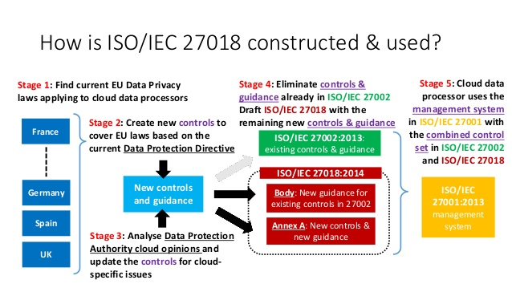

# ISO 27018, de standaard voor privacy in de Cloud

Op deze pagina vind je informatie omtrent de ISO 27018 standaard.

## Inhoud
* [Wat houdt de ISO 27018 standaard in?](#standaard)
* [5 belangrijke richtlijnen van ISO 27018](#richtlijnen)
* [Hoe kan ISO 27018 in de praktijk gebruikt worden?](#praktijk)
* [Sterke punten ISO 27018](#sterk)
* [Zwakke punten ISO 27018](#zwak)
* [Hoe conformeren AWS & Azure zich aan de ISO 27018 standaard?](#publiccloud)
    * [AWS](#aws)
    * [Azure](#azure)
* [Filmpje](#filmpje)
* [Bronnen](#bronnen)

## Wat houdt de ISO 27018 standaard in?

De ISO 27018 standaard is bedoeld voor Cloud aanbieders die persoonsgegevens verwerken (de norm noemt dit Personally Identifiable Information, PII) en richt zich op de beveiliging en behandeling van deze gegevens. Denk aan persoonlijke gegevens van klanten, gezondheids- en patiëntinformatie of informatie over burgers. Voor veel afnemers geeft een ISO27018 certificering van de clouddienst aanbieder extra zekerheid dat deze gevoelige data niet in verkeerde handen komt. De norm is ook gebaseerd op de ISO 27002, maar heeft een aanvullende set van beheersmaatregelen specifiek gericht op het beschermen van persoonsgegevens. Denk daarbij aan toestemming, gegevensminimalisatie en privacy klachten. Geheel in lijn met de eisen uit de AVG [[1]](#1).

## 5 belangrijke richtlijnen van ISO 27018

ISO 27018 is voornamelijk een uitwerking van de meer algemene privacy standaard ISO 27002, aangepast aan de Cloud. De inhoudelijke eisen van ISO 27018 zijn een antwoord op de steeds sterker wordende vragen van Europese privacy-toezichthouders over de verwerking van persoonsgegevens bij de grote, meestal Amerikaanse, clouddienstverleners [[2]](#2). 

De belangrijkste eisen die in deze norm zijn opgenomen [[3]](#3):

1.	Controle en Toestemming 
    
    De klant heeft de regie over zijn eigen data. De Cloud leverancier mag PII alleen verwerken in overeenstemming met de instructies van de klant. PII kan alleen worden verwerkt voor marketing- of advertentiedoeleinden met de uitdrukkelijke toestemming van de klant.

2.	Security 

    Naleving van ISO 27018 biedt een aantal belangrijke veiligheidsmaatregelen voor de klant. Het definieert beperkingen op hoe providers omgaan met PII, inclusief beperkingen op de overdracht ervan via openbare netwerken, opslag op verplaatsbare media en de juiste processen voor gegevensherstel. 

    De norm vereist ook dat aanbieders vertrouwelijkheidsovereenkomsten sluiten met personeel die toegang hebben tot PII en gebruik maken van deze data. Ook moeten zij het personeel passende trainingen geven.

3.	Meldingen en communicatie van datalekken

    Als er een datalek plaatsvindt dat resulteert in het verlies, de openbaarmaking of de wijziging van PII, vereist ISO 27018 dat de provider de klant op de hoogte stelt van de inbreuk en duidelijke gegevens over het incident bijhoudt. De Cloud provider is ook verplicht om klanten te helpen bij het naleven van de eigen meldingsverplichtingen van de klant (bijvoorbeeld aan een eindgebruiker of een toezichthouder) en om hen te helpen hieraan te voldoen wanneer individuen hun gegevenstoegangsrechten uitoefenen.

    Vanuit het perspectief van de Cloud provider staat de norm de provider toe om alleen persoonlijke informatie bekend te maken aan wetshandhavingsinstanties als hij hiertoe wettelijk verplicht is. Wetshandhavingsverzoeken om openbaarmaking van PII moeten aan de klant worden bekendgemaakt.

4.	Transparantie

    Voor aan het aangaan van een overeenkomst voor Cloud computing-services, moeten providers de namen van eventuele sub verwerkers bekendmaken en de mogelijke locaties waar PII verwerkt kunnen worden. De provider moet transparant zijn over zijn beleid met betrekking tot het retourneren, overdragen en verwijderen van PII die is opgeslagen in zijn datacenters. Dit zorgt ervoor dat de klant weet wat er met zijn gegevens gebeurt.

5.	Onafhankelijke audits

    Deze vereiste zorgt ervoor dat regelmatige beoordelingen van informatiebeveiliging en algemene naleving door de Cloud serviceprovider worden verkregen via een onafhankelijke externe audit.

## Hoe kan ISO 27018 in de praktijk gebruikt worden?

In het voorbeeld hieronder kun je zien hoe het gebruik van ISO 27018 eruit kan gaan zien in de praktijk:

*Figuur: Een voorbeeld van ISO27018 in de praktijk.* [[4]](#4)

## Sterke punten ISO 27018
Er zijn verschillende voordelen om ISO 27018 te gebruiken. Deze voordelen worden hieronder beschreven.

* Verhoogd klantvertrouwen

    Klanten voelen zich zekerder in het vertrouwen van een Cloud serviceprovider die validering door derden van markt specifieke best practices kan aantonen. Als een Cloud serviceprovider voldoet aan ISO 27018, betekent dit dat hij een diepgaand begrip heeft van hoe veilig met PII kan worden omgegaan en dat hij toegewijd is aan het beschermen van de gegevens van zijn klanten. Dit helpt het om zijn merk te onderscheiden van concurrenten.

* Wereldwijde operaties

    Omdat ISO 27018-richtlijnen universeel zijn en van toepassing zijn op andere landen naast de Verenigde Staten, maakt conformiteit het voor Cloud serviceproviders gemakkelijker om deel te nemen aan de wereldwijde markt en voor klanten om internationale contracten te ondertekenen.

* Sneller contractproces

    Het is niet ongebruikelijk dat een klant een Cloud serviceprovider vraagt om verschillende vragen te beantwoorden over zijn standaardpraktijk voor het omgaan met PII. Door te voldoen aan ISO 27018, kunnen veel van deze vragen worden beantwoord via je product.
    Er is ook de kwestie van cyberverzekeringen. Een cyberverzekering is nodig om de kosten van een datalek of andere privacy schending te dekken. Het is duur, er ontbreekt een norm en het kan het contractproces snel doen ontsporen. Maar cyberverzekeringsmaatschappijen zien liever beveiligingsreferenties, zoals ISO 27018, en hun algemene voorwaarden weerspiegelen dit.

* Juridische bescherming voor providers en gebruikers

    De richtlijnen en controles binnen de ISO 27018-norm zijn bestand tegen audits, vragen van klanten en andere overheidsbeoordelingen. In wezen is de standaard als een "veilige haven" tegen datalekken, omdat het bewijst dat de provider niet nalatig was in zijn pogingen om PII te beschermen.

[[5]](#5)

## Zwakke punten ISO 27018

Daarnaast zijn er enkele ongebruikelijke eisen waaraan een Cloud serviceprovider onder de nieuwe standaard moet voldoen. Er zijn bijvoorbeeld een aantal verwijzingen naar zowel fysieke opslagmedia als papieren materialen, die enigszins misplaatst lijken in een lijst met vereisten voor online clouddiensten. Vanuit het perspectief van een Cloud provider is de meest uitdagende criteria van de nieuwe richtlijn het opschonen van eerdere klantgegevens voor een nieuwe klant die dezelfde ruimte gebruikt. De andere grote uitdaging is het documenteren waar PII is opgeslagen [[3]](#3).

## Hoe conformeren AWS & Azure zich aan de ISO 27018 standaard?

### AWS
Afstemming met ISO 27018 toont aan dat AWS een controlesysteem heeft dat specifiek gericht is op de privacybescherming van de inhoud van AWS-klanten.

Afstemming met de ISO 27018-praktijkcode biedt de zekerheid dat:
* Klanten hebben controle over hun inhoud.
* De inhoud van klanten zal niet worden gebruikt voor ongeautoriseerde doeleinden.
* Fysieke media worden vernietigd voordat ze de datacenters van AWS verlaten.
* AWS biedt klanten de mogelijkheid om hun inhoud te verwijderen.
* AWS maakt de inhoud van klanten niet openbaar, tenzij dit vereist is om te voldoen aan een wettelijk geldige en bindende bestelling.

[[6]](#6)

### Azure
Microsoft Azure en Azure Duitsland worden gecontroleerd op naleving van ISO / IEC 27001 en ISO / IEC 27018 door een geaccrediteerde externe certificeringsinstantie, waardoor onafhankelijke validatie wordt geboden dat de toepasselijke beveiligingscontroles aanwezig zijn en effectief werken.

Door de normen van ISO / IEC 27001 en de praktijkcode die is vervat in ISO / IEC 27018 te volgen, toont Microsoft aan dat haar privacy beleid en -procedures robuust zijn en in overeenstemming met de hoge normen.

[[7]](#7)

## Filmpje
The Impact of ISO 27018 on Cloud Contracts – the First Year

[Link](https://www.youtube.com/watch?v=y1h18Xq4NvE)

## Bronnen
<a id="1">[1]</a> DigiTrust. (2020, 24 september). ISO 27017 en ISO 27018. https://www.digitrust.nl/iso-27017-en-iso-27018/

<a id="2">[2]</a> Atzema, H. (2015, 3 maart). ISO 27018, de nieuwe standaard voor privacy in de cloud? Ictrecht. https://www.ictrecht.nl/blog/iso-27018-de-nieuwe-standaard-voor-privacy-in-de-cloud

<a id="3">[3]</a> Silicon Republic. (2015, 21 september). ISO 27018, the cloud computing privacy standard: one year on. https://www.siliconrepublic.com/enterprise/iso-27018-cloud-computing-privacy-standard

<a id="4">[4]</a> Corporacion Colombia Digital. (2015, 16 juni). Cloud Services & the Development of ISO/IEC 27018. Slideshare. https://www.slideshare.net/ColombiaDigital/3-27018-for-cloud-users-and-providers-v1

<a id="5">[5]</a> Mackie, R. (2016, 29 augustus). ISO 27018: What Cloud Providers Need to Know. Schellman & Company. https://www.schellman.com/blog/iso-27018-what-cloud-providers-need-to-know

<a id="6">[6]</a> Woolf, C. (2015, 16 oktober). AWS Obtains ISO 27018 Privacy Certification. Amazon Web Services. https://aws.amazon.com/blogs/security/aws-obtains-iso-27018-privacy-certification/

<a id="7">[7]</a> Mazzoli, R. (2020, 30 november). ISO/IEC 27018 Code of Practice for Protecting Personal Data in the Cloud - Microsoft Compliance. Microsoft Docs. https://docs.microsoft.com/en-us/compliance/regulatory/offering-iso-27018
